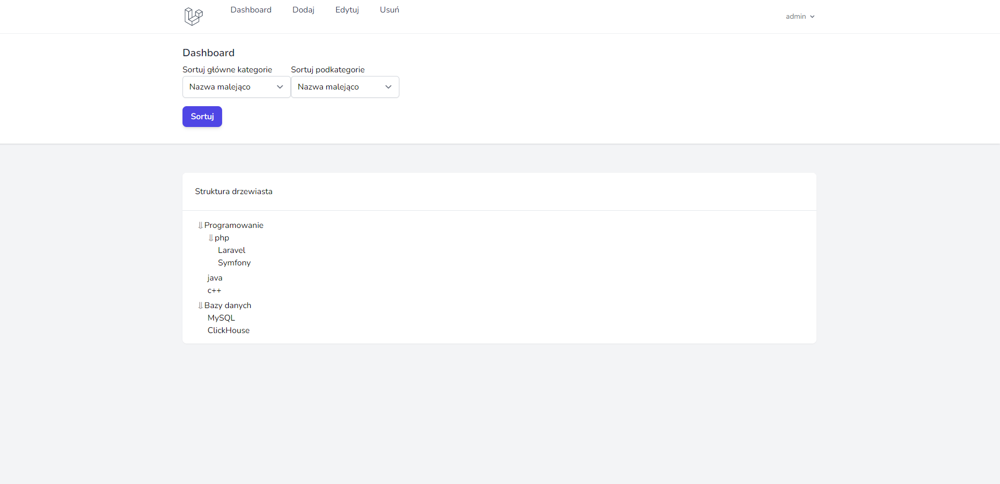

# Zarządzanie strukturą drzewiastą

Administrator posiada możliwość dodawania, edycji, usuwania, sortowania, przenoszenia węzłów do innych gałęzi oraz przeglądania struktury drzewiastej.

User posiada tylko możliwość przeglądania oraz sortowania węzłów oraz liści.

W celu ułatwienia sprawdzenia projektu utworzony został seeder z przykładowymi danymi.

## Przykładowe dane do logowania
Administrator:
```bash
  Email: admin@email.com
  Hasło: adminadmin
```
User:
```bash
  Email: user@email.com
  Hasło: adminadmin
```


## Screenshots

Widok po zalogowaniu jako administrator:


Widok po zalogowaniu jako user:

